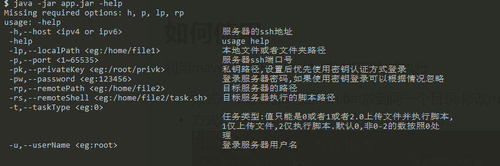

# java ssh client 使用
利用 java ssh 客户端上传文件执行目标服务器脚本.
## 用途
 - 完成自动部署
 - 定时执行某些需要手动执行的任务
 - 批处理
## 如何使用
利用maven编译出jar文件,通过如下方式执行
 - 方式一:将jar包跟run.bat放到同一个目录,修改run.bat中的参数,运行run.bat
 - 方式二:根据jar包提示的提示,输入参数执行

